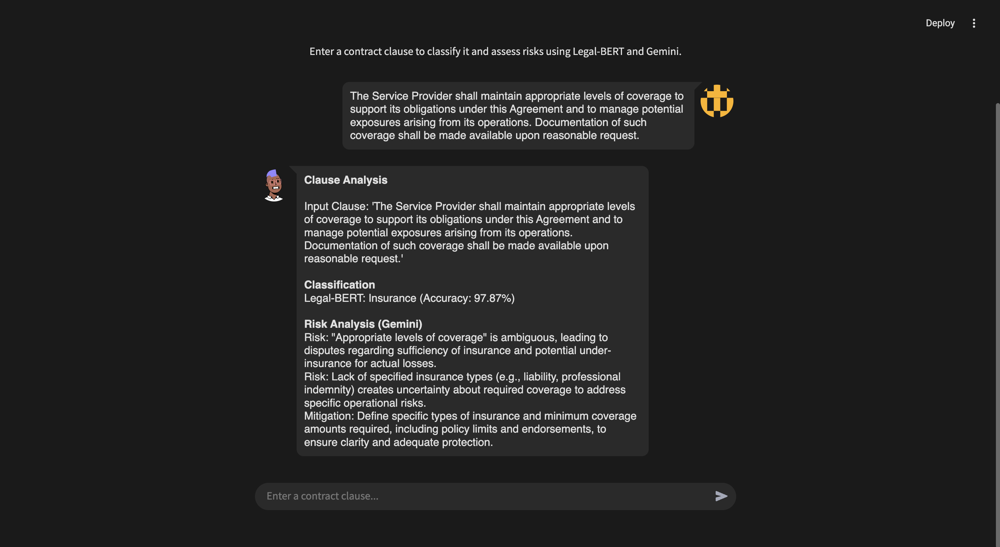

# LegalClause: Legal Contract Clause Classification & Risk Analysis


## Overview

LegalClause is an intelligent legal assistant that transforms manual contract review through automated clause classification and risk analysis. Using state-of-the-art NLP models including a fine-tuned Legal-BERT model, this tool helps legal professionals:

- Identify clause types (Cap on Liability, Audit Rights, Insurance)
- Analyze potential legal risks in contract clauses
- Suggest mitigation strategies for identified risks
- Save valuable time in contract review processes

The system achieves **97.87% classification accuracy** and delivers actionable risk insights through an intuitive chat-based interface.



*Screenshot: LegalClause analyzing an insurance clause, identifying the clause type with Legal-BERT, and providing risk analysis with Gemini*

## Features

- **Smart Clause Classification**: Automatically identifies clause types with high accuracy
- **Risk Identification**: Detects ambiguities, compliance issues, and potential legal vulnerabilities
- **Mitigation Suggestions**: Offers actionable recommendations to enhance clarity and protect interests
- **User-Friendly Interface**: Chat-based Streamlit application for easy interaction
- **Comprehensive Analysis**: Combined classification and risk assessment in a single workflow

## Getting Started

### Prerequisites

- Python 3.8+
- Streamlit
- PyTorch
- Transformers
- Google API key for Gemini (if using the risk analysis feature)

### Installation

1. Clone the repository:
```bash
https://github.com/rkpm22/LegalClause.git
cd LegalClause
```

2. Create and activate a virtual environment:
```bash
python -m venv venv
source venv/bin/activate  # On Windows: venv\Scripts\activate
```

3. Install required dependencies:
```bash
pip install -r requirements.txt
```

4. Set up your Google API key for Gemini:
```bash
# Create a .streamlit/secrets.toml file with your API key
echo "GOOGLE_API_KEY = 'your-api-key-here'" > .streamlit/secrets.toml
```

### Running the Application

The fine-tuned Legal-BERT model is hosted on Hugging Face at `RahulMandadi/fine-tuned-legal-bert` and is automatically loaded by the application.

Start the Streamlit application:
```bash
streamlit run app.py
```

Access the application in your browser at `http://localhost:8501`.

## Project Structure

```
LegalClause/
├── app.py                    # Streamlit application with HuggingFace model integration
├── BaselineModel.ipynb       # TF-IDF + SVM implementation
├── LegalBERTFineTuning.ipynb # Legal-BERT model fine-tuning
├── RiskAnalysis.ipynb        # Gemini integration for risk analysis
├── EDA.ipynb                 # Exploratory Data Analysis
├── requirements.txt          # Project dependencies
└── README.md                 # Project documentation
```

## Models and Performance

### Baseline Model (TF-IDF + SVM)
- **Accuracy**: 85.16%
- **Precision**: 90.36%
- **Recall**: 76.05% 
- **F1 Score**: 73.34%

### Fine-tuned Legal-BERT
- **Accuracy**: 97.87%
- **Precision**: 97.86%
- **Recall**: 97.21%
- **F1 Score**: 97.51%

The fine-tuned Legal-BERT model is hosted on HuggingFace at `RahulMandadi/fine-tuned-legal-bert` and can be accessed directly via the Transformers library. It significantly outperforms the baseline across all metrics, particularly in recall, which is critical for legal applications where missing relevant clauses can have serious consequences.

## Future Enhancements

- **More Clause Types**: Expand to include indemnification, termination, and other important clauses
- **Advanced NLP**: Integrate GPT-4o1 for deeper contextual insights
- **Clause Drafting**: Add auto-suggestions to mitigate identified risks
- **Integration**: Connect with DocuSign and other legal tools
- **Enhanced Interaction**: Support follow-up questions in the chatbot

## How It Works

1. **Clause Input**: Users enter contract clauses into the Streamlit chat interface
2. **Classification**: The application loads the fine-tuned Legal-BERT model from HuggingFace (`RahulMandadi/fine-tuned-legal-bert`) to identify the clause type
3. **Risk Analysis**: Google's Gemini 2.0 Flash API (`gemini-2.0-flash-thinking-exp-01-21`) analyzes the clause for potential legal risks
4. **Output**: The system displays the classification result and risk analysis in a structured format with markdown formatting

## License

This project is licensed under the MIT License - see the LICENSE file for details.

## Acknowledgments

- [LegalBench CUAD dataset](https://www.atticusprojectai.org/cuad) for training data
- [Legal-BERT](https://huggingface.co/nlpaueb/legal-bert-base-uncased) by AUEB NLP Group
- Google's Gemini API for risk analysis capabilities
- Streamlit for the interactive web framework
